# 📊 Credit Card Application Record Data Analysis & Predictive Modeling

This project provides a comprehensive analysis of application data, combining exploratory data analysis (EDA), data preprocessing, and machine learning to uncover insights and build predictive models. The goal is to understand applicant characteristics and develop a system to predict outcomes such as application approval, risk, or eligibility.

---

## 🔍 Objectives
- Explore the demographic and financial characteristics of applicants.
- Identify key patterns and relationships in the data.
- Prepare the data for machine learning by cleaning and encoding.
- Build and compare multiple classification models to predict target outcomes.
- Interpret model results to understand what drives predictions.

---

## 📁 Dataset
The project is based on a structured dataset (`application_record.csv`) with features such as:
- Applicant age, gender, income
- Family status, education, employment type
- Number of children, housing situation, etc.

---

## 📊 Exploratory Data Analysis (EDA)
EDA is performed using `Seaborn` and `Matplotlib` to visualize:
- Distribution of age, income, and family size
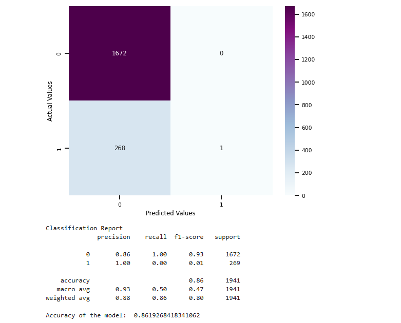

- Frequency of categorical features like gender, housing, and work type
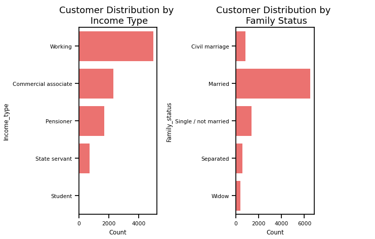
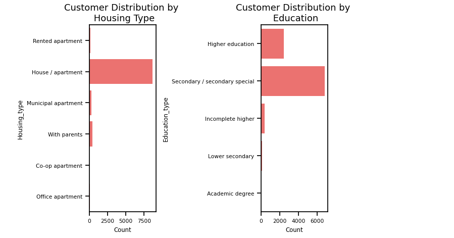
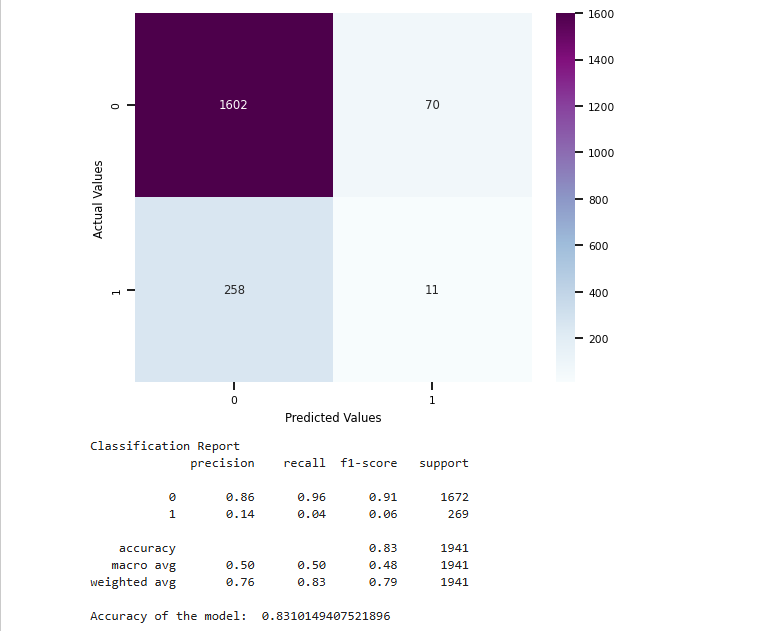

- Correlation heatmaps to identify feature relationships
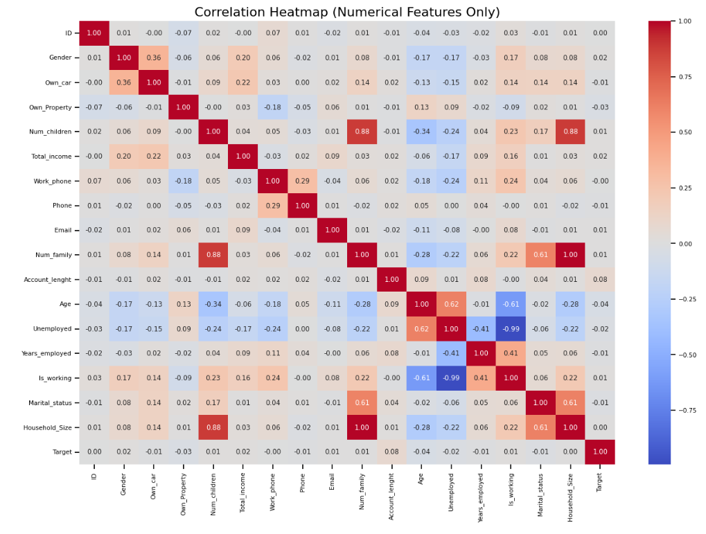
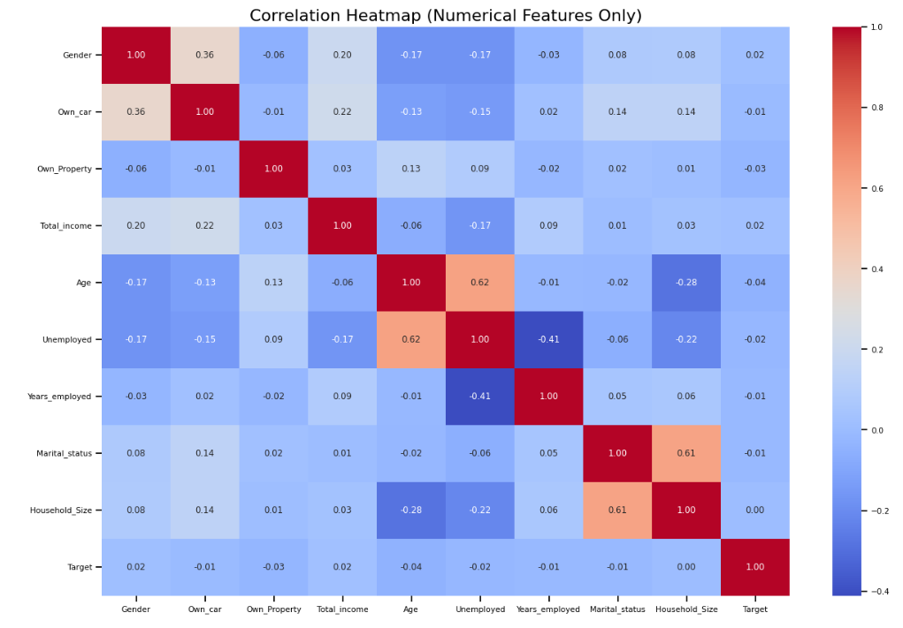

- Boxplots to detect outliers and assess variance
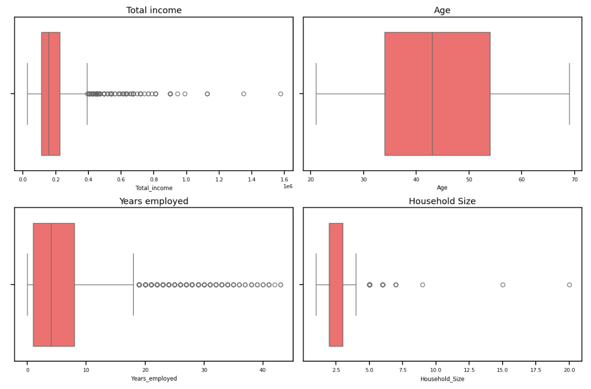
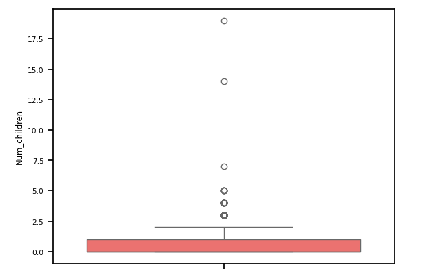

---

## 🧹 Data Preprocessing
- Missing values are handled appropriately (imputation or removal).
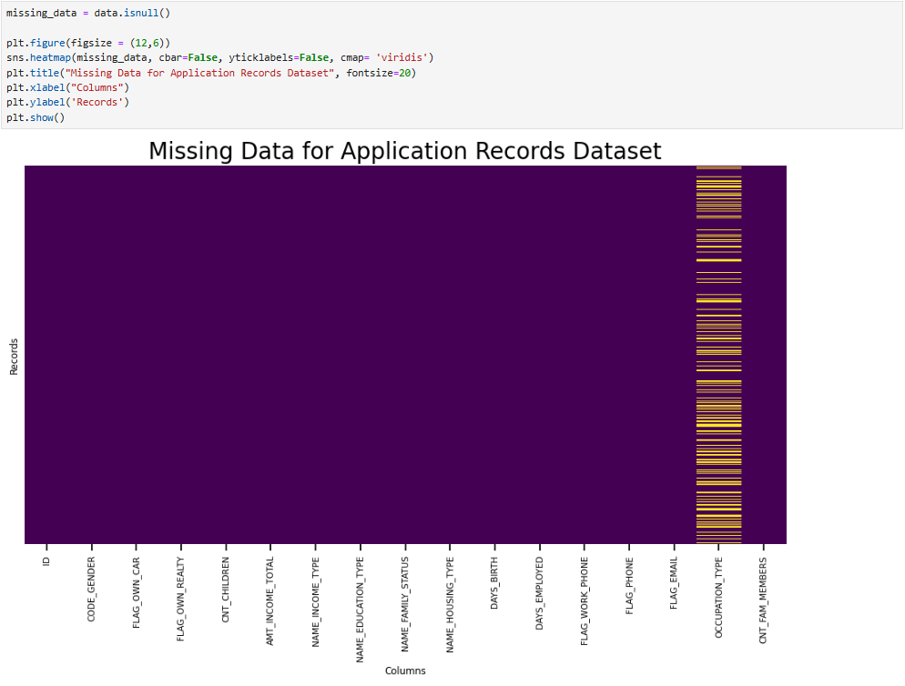
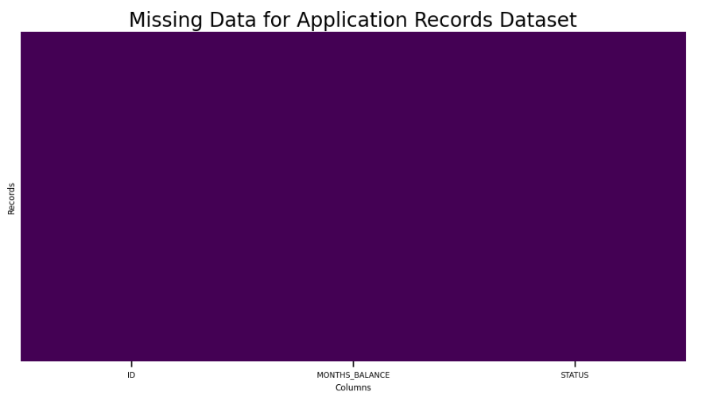
- Categorical variables are label encoded for modeling.

- The dataset is split into train and test sets for fair evaluation.

---

## 📊 Feature Importance
Important features of the model, sorting according to importance.

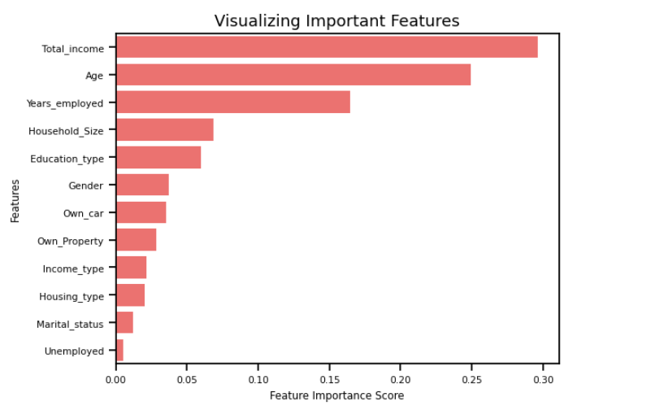

---

## 🤖 Machine Learning Models Peformance Before SMOTE Process
A range of classification algorithms are used to build predictive models:
- **Logistic Regression**
  
- **Decision Tree Classifier**
  
- **Random Forest Classifier**
  
- **XGBoost Classifier**
  
- **Extratrees Classifier**
  
- **AdaBoost Classifier**
  
- **Support Vector Machine (SVM)**
  
- **K-Nearest Neighbors (KNN)**
  

## ⚖️ SMOTE Process
Used SMOTE to balance the class distribution in the training data by generating synthetic samples for the minority class (label 1), increasing it from 893 to 5897 to match the majority class. It also scales features using StandardScaler and splits the data with train_test_split before oversampling.

## 🤖 Machine Learning Models Performance After SMOTE Process
A range of classification algorithms are used to build predictive models:
- **Logistic Regression**
  
- **Decision Tree Classifier**
  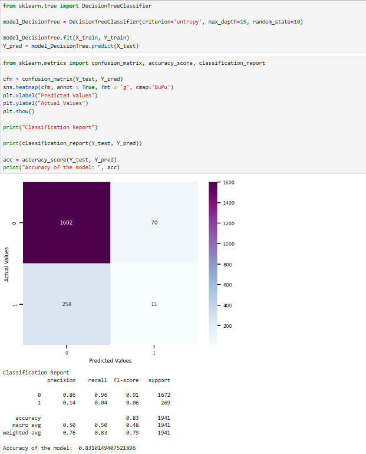
- **Random Forest Classifier**
  
- **XGBoost Classifier**
  
- **Extratrees Classifier**
  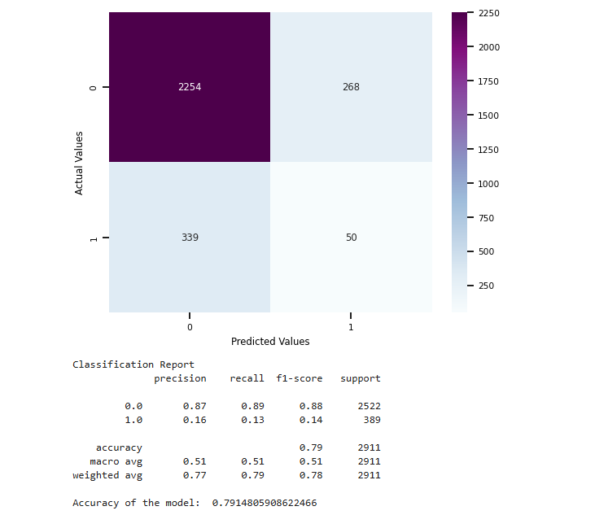
- **AdaBoost Classifier**
  
- **Support Vector Machine (SVM)**
  
- **K-Nearest Neighbors (KNN)**
  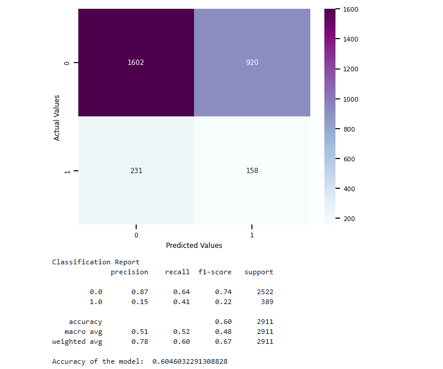

Each model is evaluated based on its predictive performance, allowing comparison and selection of the best-performing approach.

---

## 📌 Insights & Outcomes
- Clear visualization of applicant distribution and demographic trends.
- Identification of key influencing factors via correlation and feature importance.
- Predictive modeling that can assist organizations in decision-making processes such as risk analysis or automated application approval.

## 🎯 Conclusion
Among all the models tested, Logistic Regression and K-Nearest Neighbors (KNN) delivered the most balanced performance, achieving higher F1-scores, which indicates a better trade-off between precision and recall — making them the most suitable choices for this classification task.

## 💡 Key Learning:
This project clearly demonstrates that accuracy alone is not a reliable metric in machine learning, especially when dealing with imbalanced datasets. Instead, a balanced F1-score, along with strong recall and precision for both classes, gives a more meaningful evaluation of model performance. It also highlights how class imbalance can significantly skew model results, emphasizing the importance of techniques like SMOTE to ensure fair learning.

---

## 🔗 Future Scope
- Integrate more real-world data (e.g., credit bureau reports).
- Tune hyperparameters for model optimization.
- Build a web app to deploy the prediction system.
